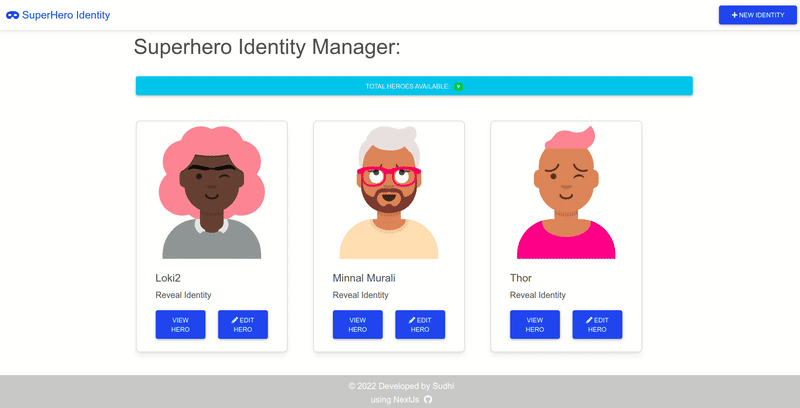

## SuperHero Identity Manager

View the App here: https://superhero-identity.netlify.app

### Features:

    * Create a new SuperHero Identity
    * View (Reveal) all SuperHero Identities
    * Update a SuperHero Identity
    * Delete a SuperHero Identity

### Demo:



### About the App

WORLD is full of 🤜superheroes🤛 (atleast in MCU & DC universe) perhaps in other worlds too. You may also know few of them but you don't know their identity. This app is designed to help you to manage your superheroes.

The project is a simple CRUD app for a SuperHero Identity management developed using:-

- Next.js
- MongoDB
- MDB-React-UI.

### Getting Started:

This is a [Next.js](https://nextjs.org/) project bootstrapped with `create-next-app`.

First, run the development server:

```bash
npm run dev
# or
yarn dev
```

Open [http://localhost:3000](http://localhost:3000) with your browser to see the result.

You can start editing the page by modifying `pages/index.js`. The page auto-updates as you edit the file.

### API Routes in NextJs:

> Any file inside the folder `pages/api` is mapped to `/api/*` and will be treated as an API endpoint instead of a page.

- API routes can be accessed on [http://localhost:3000/api/hello](http://localhost:3000/api/hello). This endpoint can be edited in `pages/api/hello.js`.

- Routes created for this app are:
  - http://localhost:3000/api/hero
  - http://localhost:3000/api/hero/:id
  * POST, PUT, DELETE operations are supported.

### Learn More:

To learn more about Next.js, take a look at the following resources:

- [Next.js Documentation](https://nextjs.org/docs) - learn about Next.js features and API.
- [Learn Next.js](https://nextjs.org/learn) - an interactive Next.js tutorial.

You can check out [the Next.js GitHub repository](https://github.com/vercel/next.js/) - your feedback and contributions are welcome!
